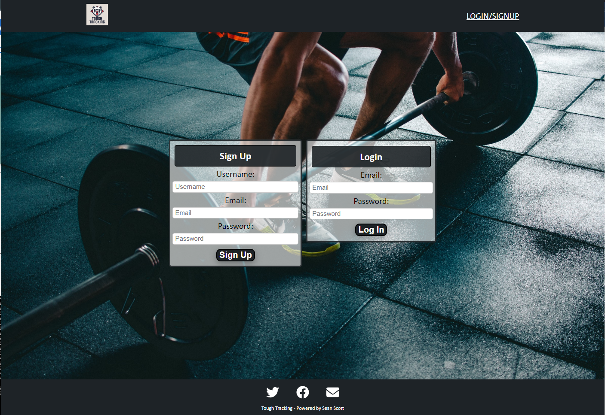

# Tough Tracking [](https://opensource.org/licenses/MIT)

## Description
<p> This application was created to plan and visualise a wokrout ahead of time. Featurres involved include creating a workout that has a list of exercises. The exercises type can be created as cardio or strength. Cardios inputs include exercise name, distance, time and intensity. Strengths inputs include exercise weight, sets and reps. Other features include being able to view a summary of your workouts in a styled card displaying the workout name, when it was created and a list of the workouts exercise names. Another page is a detailed version of your workouts where you can see all the workouts and exercises values not just their names. Each workout card on these pages has a view button which will then display that single exercise. This is where you can press the edit button and either edit the workout name and exercises. There is also a delete button when editting that will delete the workout.
</p>

<p>This application was created with JavaScript and included the following technologies:</p>

- [React.js](https://reactjs.org/)

- [Node.js](https://nodejs.org/en/)

- [Styled-Components](https://styled-components.com/)

- [apollo-server-express](https://www.npmjs.com/package/apollo-server-express)

- [bcrypt](https://www.npmjs.com/package/bcrypt)

- [express](https://www.npmjs.com/package/express)

- [graphql](https://www.npmjs.com/package/graphql)

- [json-web-token](https://www.npmjs.com/package/jsonwebtoken)

- [mongoose](https://www.npmjs.com/package/mongoose)

- [concurrently](https://www.npmjs.com/package/concurrently)

- [apollo-client](https://www.npmjs.com/package/@apollo/client)

- [swiper](https://www.npmjs.com/package/swiper)
    
## Table of Contents 
- [Screenshots](#Screenshots)
- [Installation](#Installation)
- [Usage](#Usage)
- [License](#License)
- [Contribution](#Contribution)
- [Tests](#Tests)
- [Questions](#Questions)
- [Links](#Links)

## Screenshots

<p>Homepage Logged In</p>

- 

<p>Login and Signup Page</p>

- 

<p>Create Workout</p>

- 

<p>Cardio form</p>

- 

<p>Edit Workout</p>

- 

<p>Dashboard page</p>

- 

<p>All Workouts</p>

- 

<p>No Workouts</p>

- 

<p>Mobile Homepage</p>

- 

<p>Mobile Create</p>

- 

## Installation
<p> To use this app online please click on the link at the bottom of the page</p>

<p>If you would like to download the application please follow these instructions:
</p>

- Please have Node.js and npm installed.

- To start, clone this repository by using the following command:

 ```
  git clone git@github.com:seanscott95/tough-tracking.git
 ```

- In your terminal navigate to the cloned repository and run ```npm run install``` to install the node modules needed for this application.

- Then enter ```npm run develop``` to start the application.

- If your browser doesn't open straight away you can search for it using the url ```http//:localhost:3001```

## Usage 
- When creating a workout fill in the exercise form and click add. This will add a exercise to your workout. You can add as many as you want. When you're done add a workout name and click the create button. You can edit and delete the workout by viewing a single workout.

## License 
<p> This application is covered under the:</p>

- [MIT-License](https://opensource.org/licenses/MIT)

## Contribution 
<p> None.</p>

## Tests 
<p> This application was not developed using Test Driven Development.</p>

## Questions 
<p> To reach me with additional questions please contact me via one of the following methods: </p>

- [GitHub](https://github.com/seanscott95)
- [Email](mailto:seanms418@gmail.com)
- [LinkedIn](https://www.linkedin.com/in/sean-scott-18ba07225/)

## Links
- [GitHub](https://github.com/seanscott95/tough-tracking)
- [Tough Tracking](https://tough-tracking.herokuapp.com/)